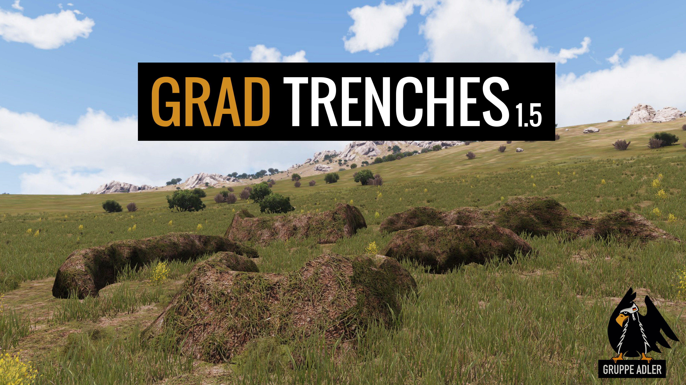
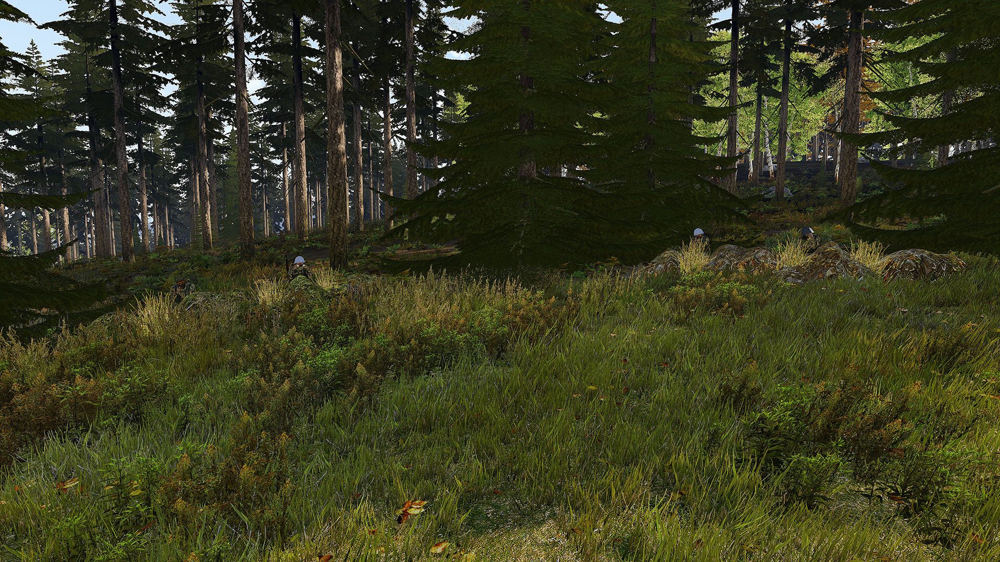
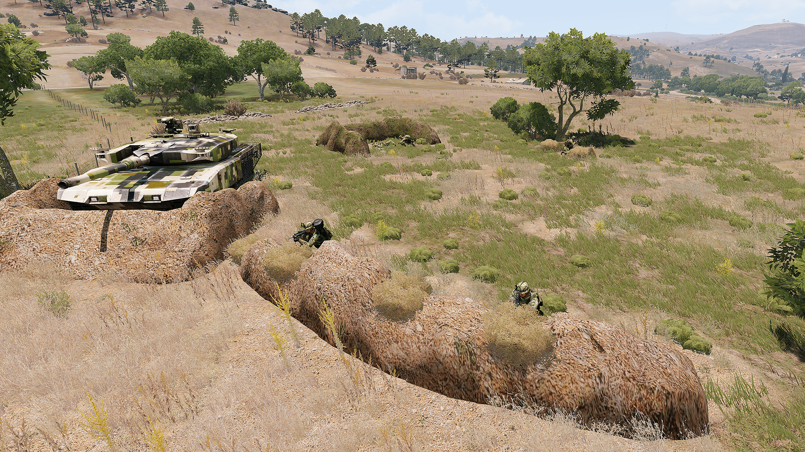

    
    
    
    
    
    
    

    <strong>Visit Gruppe Adler on <a href="https://www.gruppe-adler.de/">our Website</a> | <a
    href="https://www.youtube.com/user/gruppeadler">YouTube</a> | <a href="https://twitter.com/Gruppe_Adler">Twitter</a></strong>

This mod adds textures to ACE trenches based on the current ground texture. When placing a trench you can already see a preview how the trench will look like when placing it. Players can also camouflage their trenches with small bushes.

More images can be found [here](https://github.com/gruppe-adler/grad_trenches#more-images).

## Features
- Camouflage your trench with small bushes
- Place trenches in 3DEN and camouflage them directly
- New trenches to place by 0Y0 & max1048
    - Giant trench where soldiers can stand behind
    - Vehicle trench to cover vulnerable parts of tanks
    - Short trench to quickly provide cover for 1-2 soldiers
    - Long Trench to give cover to more people

## Requirements
- Arma 3 2.0 or later
- [ACE3](https://github.com/acemod/ACE3) 3.11.0 or later
- [CBA_A3](https://github.com/CBATeam/CBA_A3) 3.5.0 or later

## Downloads
#### GitHub
Downloads can be found under [Releases](https://github.com/gruppe-adler/grad_trenches/releases).  

#### Steam Workshop
Subscribe to GRAD Trenches on [Steam Workshop](http://steamcommunity.com/sharedfiles/filedetails/?id=1224892496) and automaticially get the latest releases.

## License
See LICENSE

## Bugs and Contributions
Contributions and bug reports are well appreciated. Feel free to fork this project or to create issues.
#### Bugreports
When encountering an error message when placing a trench please atatch your RPT-File so we can directly analyze the problem.

### Build
In a bash write:
start build-hemtt.bat

Debugging:
export BIOUTPUT=1

## More images
*Click on the images to see a high quality version*
  

